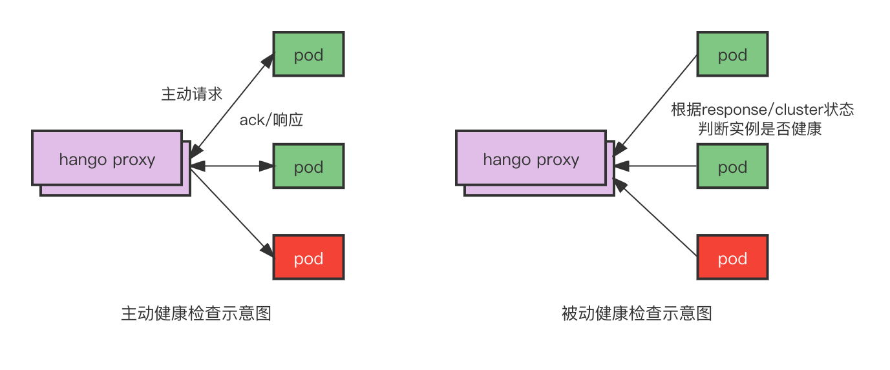
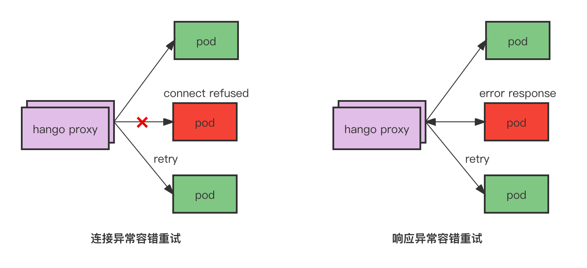
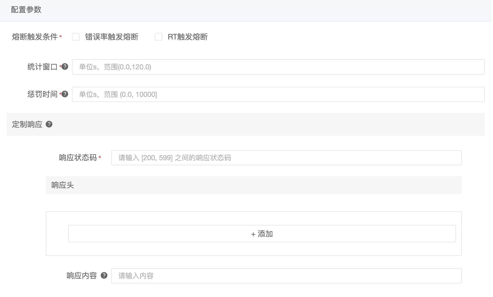
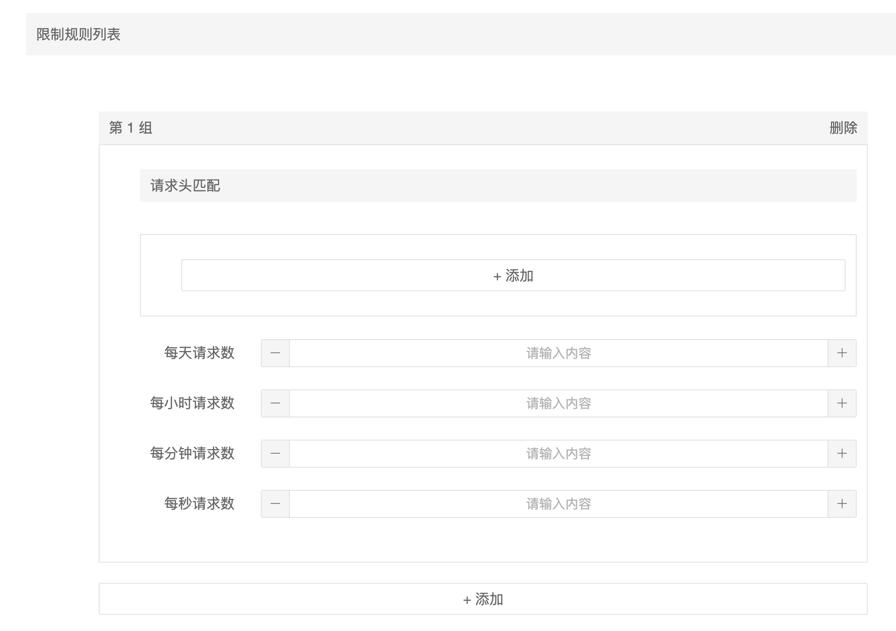
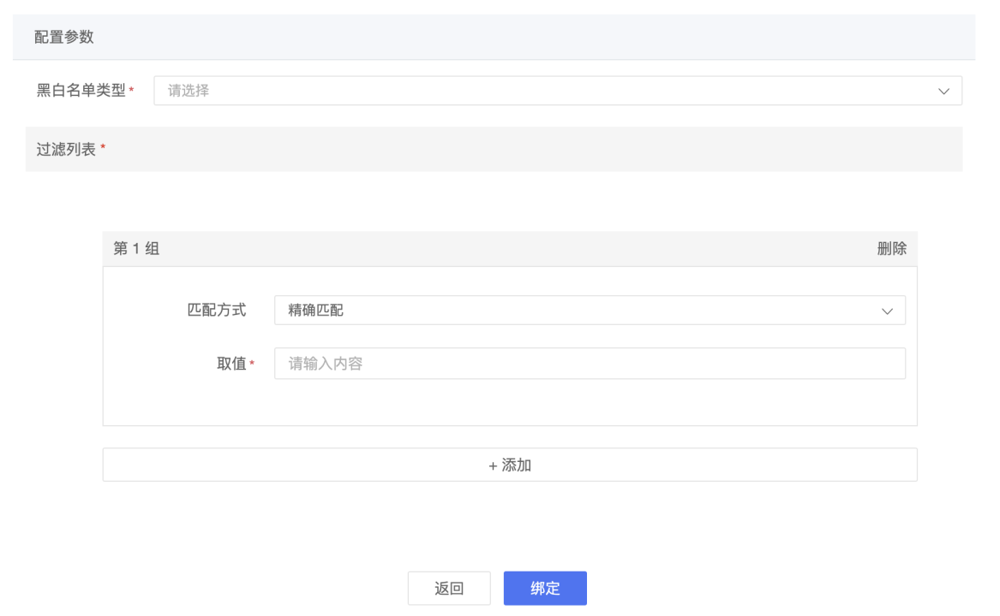
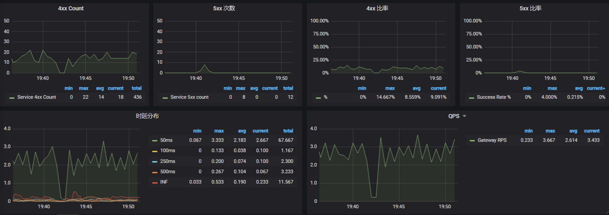

- [一、导读](#一导读)
- [二、Hango 演进道路](#二Hango演进道路)
- [三、Hango 架构](#三Hango架构)
- [四、功能演进](#四功能演进)
  - [4.1 路由](#41-路由)
    - [精细化路由](#精细化路由)
    - [负载均衡](#负载均衡)
    - [健康检查](#健康检查)
    - [容错](#容错)
  - [4.2 治理](#42-治理)
    - [降级](#降级)
    - [熔断](#熔断)
    - [限流](#限流)
    - [安全](#安全)
  - [4.3 可观测](#43-可观测)
- [五、展望](#五展望)

## 一 导读

Hango 发V1.0版本，针对架构及功能进行升级。结合网易内部的实践，推出升级版Hango 网关。本文主要介绍Hango 网关的演进道路，并介绍Hango V1.0版本的架构。从功能演进角度更近一步描述Hango 网关丰富的功能。最后对Hango网关后续版本进行介绍。

## 二 Hango演进道路

Envoy社区最近发起了Envoy-Gateway项目；Hango团队从19年就开始关注Envoy作为网关的高性能及可扩展，并开始在网易集团内部探索基于Istio及Envoy构建下一代云原生网关的落地。

结合业务上云的架构，我们将Hango作为的南北向流量入口与Mesh定位的东西向流量项结合，让业务更聚焦于自身的服务迁移。我们充分利用了Envoy的强大扩展能力，自研Rider模块对Envoy进行用户自定义扩展，同时在落地过程中，我们结合传媒、电商大促等多场景，沉淀并积累了多个内置C++高性能插件，涵盖服务治理，安全，流量控制等多维度。

同时在落地过程中，我们注意到多注册中心场景下的业务支持，丰富了原生K8S注册中心的能力，对Eureka、Nacos、Zookeeper等注册中心业务与K8S注册中心业务进行模型统一；针对Dubbo协议的治理，Hango团队对Envoy dubbo proxy进行了主导，在内部实践的基础上将之贡献至社区。

## 三 Hango架构

基于Istio-Envoy实现的Hango 云原生网关，在本次版本进行核心组件架构升级，并推出基于社区istio增强的Hango istio模块。

针对性的增强了Slime Plugin，支持细粒度的Listener 端口维度的plugin下发。扩展了两个自定义CRD定义，分别为： 
  - pluginmanagers.microservice.slime.io：针对filter的全局配置CRD。
  - envoyplugins.microservice.slime.io：细化到VirtualHost或Route维度的具体plugin配置。
  
在Rider扩展模块，将原有的on_request和on_response函数近一步拆分为Header和Body阶段函数：on_request_header, on_request_body, on_response_header, on_resposne_body。增加了针对body处理的API，解决了之前版本处理body需要挂起lua协程的性能问题。

## 四 功能演进
### 4.1 路由
#### 精细化路由

丰富的路由能力为业务接入网关提供便利，Hango网关支持多维度的基于Path、Method、QueryParams、Header的路由匹配；

在Path维度可以配置精确、正则、前缀三种匹配方法；同时引入路由优先级的概念，使得业务在两个相同参数匹配路由冲突的情况下自由配置路由优先级，更加灵活的控制路由的生效顺序。

在配置维度，支持基于upstream 版本以及参数的维度进行版本分流及参数分流。

#### 负载均衡

Hango网关作为入口的反向代理服务，支持针对Upstream维度的精细化负载均衡及连接池配置。

在TCP维度，支持连接超时，最大连接数以及TcpKeepAlive多维度的TCP连接配置；结合Hango网关控制台，用户可以在巡检阶段针对服务维度进行TCP连接定制，以应对热点事件的发生。

在HTTP维度支持连接空闲超时、每个连接的最大请求数、最大pending数等维度的配置，其中空闲超时使得网关可以主动回收非活跃的连接，用于避免upstream主动断开连接所产生的connection reset异常；结合连接数的配置，可以有效的在突发请求过程中对upstream进行熔断。

Hango在新版本中支持了upstream的负载均衡配置，目前支持轮询、随机以及最小连接的简单负载均衡场景，同时也支持基于特征值，源IP、特定Header的一致性Hash。

#### 健康检查

新版本的Hango网关开放了对Upstream的健康检查配置，包括主动健康检查和被动健康检查。

下图是主动健康检查和被动健康检查的示意图，箭头方向只是描述了具体的健康检查的数据流，主动健康检查是proxy主动发起对应的健康检查流；被动健康检查依赖upstream的状态判断实例健康度。

主动健康检查分为TCP以及HTTP两个维度。
 - TCP健康检查允许Hango proxy针对upstream的每个实例进行主动的周期性tcp port探测以判断对应的实例的健康状态；
 - HTTP健康检查支持针对服务维度配置不同的http接口。被动健康检查赋予网关根据upstream的响应进行健康实例的判断，包括业务实际5xx的响应以及异常连接等多维度的被动健康判断。

不论是主动还是被动健康检查，Hango均提供了灵活的健康阈值以及异常隔离事件，用户可以根据业务场景进行服务维度的灵活配置。

#### 容错

容错是网关的重要配置维度，丰富场景的容错配置可以使得不论是网络抖动还是业务异常波动，减少对客户端/调用方最小的影响。容错示意图如下：

Hango网关在路由发布的时候开放路由维度容错配置，基于路由维度，用户可以进行多维度的重试配置，包括重试次数，重试超时时间以及重试条件的自主配置，重试条件包括：连接失败、upstream 5xx响应返回、网络错误等多维度配置。

### 4.2 治理
#### 降级

提供静态和动态降级两种维度的降级

- 静态降级：可以配置对应的降级响应，根据降级条件判断是否需要降级，一旦满足降级条件进行降级。返回配置的降级响应。
降级响应配置参考：

- 动态降级：Hango支持动态降级响应动态调整，提供缓存降级和接口降级两个维度。

缓存降级是指降级响应来自上一次正常200请求的返回值；接口降级是指降级响应来自另外的接口，需要用户配置对应的降级请求/path。

#### 熔断

提供基于错误率和RT的熔断，hango网关会针对upstream的错误率和慢响应进行熔断。

在一定时间内，当接口出现错误或超时的次数达到危险值，需要快速失败，告知上游该接口需要进行熔断，并且在等待一段时间后能恢复请求调用。提供的主要配置参数如下：

-   熔断阈值
    熔断阈值表示触发熔断的条件，提供了错误率和RT两种触发熔断机制，即当错误率或RT延时达到设置阈值时触发熔断，两种触发条件可以同时存在。
-   统计时间窗口
    熔断器统计错误率和RT的单位时间窗口。    
-   熔断惩罚时间 
    可以理解为恢复时间，即在发生熔断后，多长时间后恢复访问。

#### 限流

Hango提供基于令牌桶实现的集群限流及本地限流。本地限流是基于envoy内存实现的限流，hango扩展了7层filter，增加proxy.filters.http.locallimit。

具体配置可以参考：

支持针对不同的请求头进行限流配置，配置维度支持天/小时/分钟/秒。

#### 安全

支持多维度的黑白名单配置，包括UA黑白名单，URI黑白名单，IP黑白名单，Refer黑白名单以及自定义Header的黑白名单配置。

若选择黑名单，则Hango网关将拦截所有在列表中的客户端的请求；若选择白名单，则网关将拦截所有不在列表中的客户端的请求。
具体配置如下：

### 4.3 可观测

Envoy针对Cluster维度具备丰富的指标观测能力，Hango网关在服务维度可观测的基础上，对社区进行增强，自研dynamic_metric_route插件，在路由维度进行了细粒度的指标能力增强。路由作为代理的最小粒度单元，通过对接Promehthues，网关管理者可以直观的对网关上的每条路由进行观测。

Hango网关支持运行时动态日志模块，用户可以根据需求定制自己的日志展示内容，在运行时进行动态修改。支持以文件、标准输入输出多种形式进行日志输出，结合成熟的第三方日志采集系统，可以进行针对AccessLog的审计。

## 五 展望

后续Hango会在多协议以及多集群方面进行增强。

多协议主要是支持Dubbo，GRPC 多协议暴露，为企业用户提供HTTP转RPC协议的能力，同时利用现有丰富的7层治理能力，协助业务进行接口暴露。
同时，针对多注册中心的能力，我们也在计划中，包括对接eureka，nacos等微服务中心，以及对接Zookeeper的Dubbo应用注册中心，协助业务快速接入网关。

多集群主要在集群高可用方面进行支持，企业用户利用多集群能力，可以构建同城双活或者异地多活的高可用微服务解决方案。
